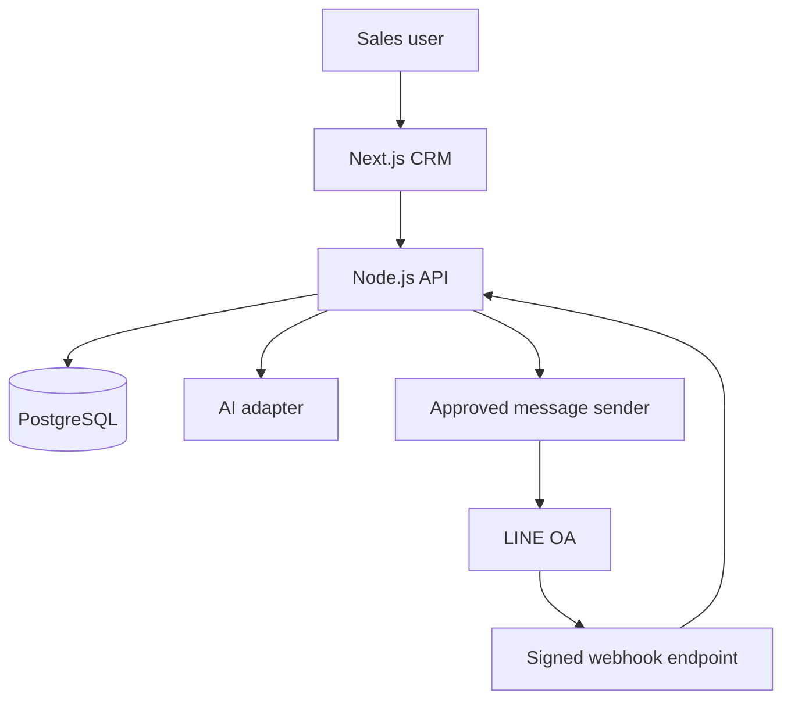

# Architecture and data flow

For the assignment's scale (20 users, 2,000 contacts, 300 active leads), the implementation keeps AI and LINE adapters as modules alongside one API deployment. A worker process can be separated without changing the database contract. This avoids distributed deployment overhead while retaining clear boundaries.

## Trust boundaries
- Browser requests authenticate to the API with a short-lived bearer token in the demo.
- The API validates user input and owns all database writes.
- AI receives minimum lead context and returns a schema-validated suggestion. It cannot write records or send messages.
- LINE webhook input is untrusted until raw-body HMAC verification succeeds.
- Outbound message status progresses through draft → approved → sent/failed. Approval is a distinct database write and is audited.

## Data flow
1. Lead intake creates/links company and contact, assigns an owner, and records its source.
2. Stage changes update the lead and append an activity plus audit event.
3. AI reads lead, recent activities and messages; output is stored in `ai_suggestions`.
4. A salesperson copies/edits the draft into a LINE message draft, approves, then requests send.
5. LINE events are signature-checked, deduplicated in `webhook_events`, and persisted in `messages`; unknown senders remain available for contact mapping.

## Key trade-offs
- PostgreSQL provides durable relational constraints and useful querying without introducing a separate search system for this volume.
- Express keeps the API small and easy to review. The same endpoint/service boundaries can move to NestJS later if module and team size grow.
- Mock/fallback AI keeps local demos reliable; a real provider is optional and must pass output validation.
- LINE integration is an adapter, not the primary CRM workflow. The CRM remains usable when LINE is unavailable.
